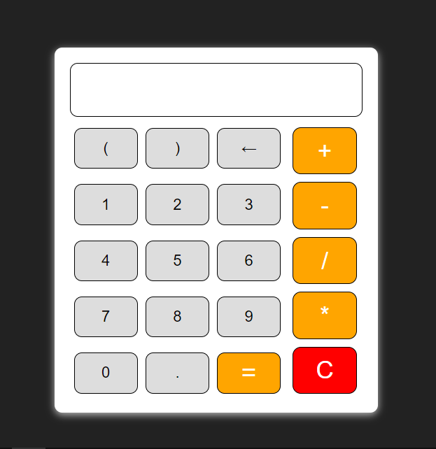

# Simple Calculator

 

A minimal and straightforward calculator designed for ease of use and functionality. This calculator performs basic arithmetic operations such as addition, subtraction, multiplication, and division. Also this calculator is well responsive and perfectly fits in any possible device.


## Features

- **Basic Arithmetic Operations**: Supports addition, subtraction, multiplication, and division.
- **Minimal Design**: Clean and simple interface for easy use.
- **Responsive Layout**: Adaptable to different screen sizes and devices.

## Installation

To use the calculator, you can simply open the HTML file in any modern web browser. There is no need for additional installation.

### Steps to Run

1. Clone or download the repository.
2. Open `index.html` in your web browser.

## Usage

The calculator provides the following functionalities:

- **Addition**: Enter two numbers and press the "+" button to add them.
- **Subtraction**: Enter two numbers and press the "-" button to subtract the second number from the first.
- **Multiplication**: Enter two numbers and press the "*" button to multiply them.
- **Division**: Enter two numbers and press the "/" button to divide the first number by the second.

### Example

1. Enter `5` in the first input field.
2. Enter `3` in the second input field.
3. Press the `+` button.
4. The result `8` will be displayed.

## Design

The calculator has been designed with a minimalistic approach, focusing on simplicity and usability. Key design elements include:

- **Clear Buttons**: Large and easily readable buttons for each operation.
- **Display Area**: Shows the current input and result.
- **Dark Theme**: Designed to fit well with dark-themed websites.

## Clone
To clone the repositary use the following command:
```bash
git clone https://github.com/YashodharChavan/Simple-Calculator.git
